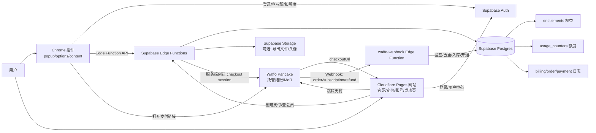
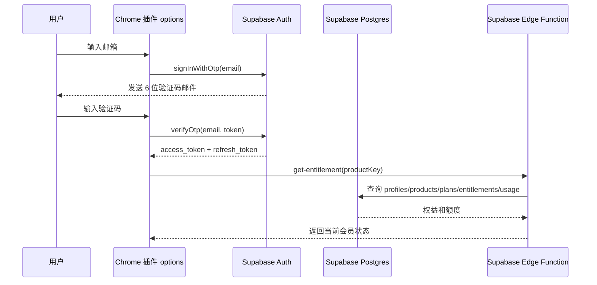
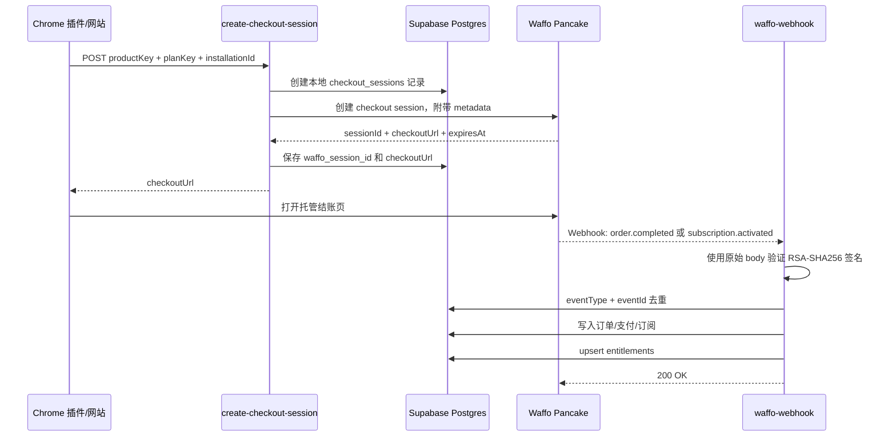
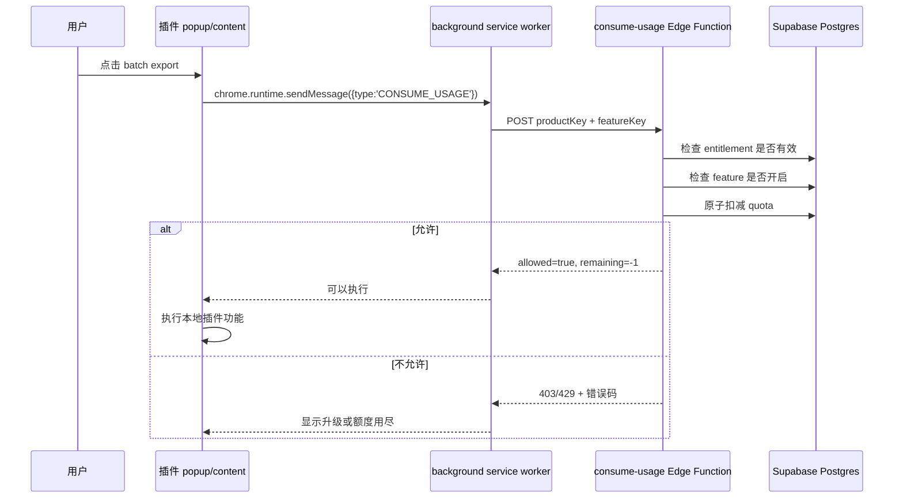

# 02. 业务与数据流转图

## 1. 总架构图

## 2. 登录数据流

## 3. 支付数据流

## 4. 插件功能执行流

## 5. 数据归属

| 数据 | 放在哪里 | 说明 |
|---|---|---|
| 官网页面 | Cloudflare Pages | SEO、静态资源、登录页、定价页、账号页 |
| 用户账号 | Supabase Auth | 邮箱 OTP / magic link |
| 用户资料 | Supabase Postgres `profiles` | 与 `auth.users` 一对一 |
| 套餐配置 | Supabase Postgres `plans` | feature/quotas 数据驱动 |
| 订单/支付/订阅 | Supabase Postgres | 来自 Waffo webhook |
| 权益 | Supabase Postgres `entitlements` | 插件和网站统一读取 |
| 使用额度 | Supabase Postgres `usage_counters` | 服务端原子扣减 |
| 插件 UI 文件 | 用户浏览器扩展环境 | 通过 Chrome Web Store 安装 |
| 插件本地状态 | `chrome.storage.local/session` | token、entitlement cache、installation_id |
| 支付页面 | Waffo Pancake | 托管结账页 |
| 导出文件 | Supabase Storage，可选 | 只有需要云端保存时使用 |

