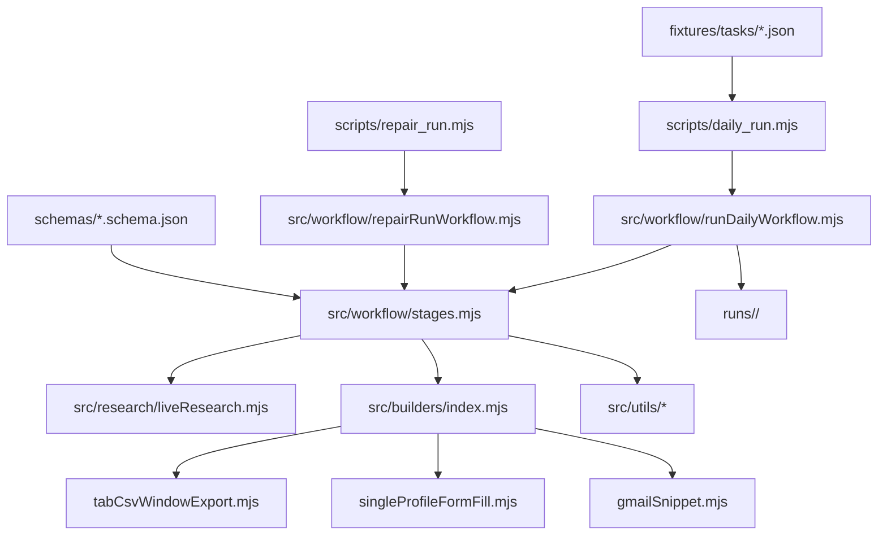

# Chrome Extension Opportunity Factory 项目状态报告

报告日期：2026-04-18

报告范围：当前仓库架构、已完成进展、测试验证情况、开发中遇到的问题、已解决问题、遗留问题和后续建议。

## 1. 总体结论

`Chrome Extension Opportunity Factory` 当前已经不是单纯 PRD 或文档草稿，而是一个可以运行的 Node.js ESM MVP。它已经能把 Chrome 扩展机会发现流程推进到“可审阅上架包”阶段。

当前已经跑通的主链路是：

```text
INGEST_TASK
-> DISCOVER_CANDIDATES
-> ENRICH_FEEDBACK
-> CLUSTER_PAIN_POINTS
-> SCORE_OPPORTUNITIES
-> BUILD_GATE
-> WRITE_BRIEF
-> PLAN_IMPLEMENTATION
-> BUILD_EXTENSION
-> RUN_QA
-> GENERATE_ASSETS
-> RUN_POLICY_GATE
-> DECIDE_PUBLISH_INTENT
-> PREPARE_LISTING_PACKAGE
```

当前项目可以完成：

- 从 `task.json` 启动一次 run。
- 发现候选扩展机会。
- 汇总公开反馈证据。
- 聚类 pain points。
- 评分并选择候选机会。
- 生成单用途产品 brief。
- 生成实现计划。
- 生成真实可安装的 Manifest V3 草稿扩展。
- 对生成物做 deterministic QA。
- 生成草稿 listing 文案和素材。
- 做基础 policy gate。
- 生成 publish intent。
- 打包出 `81_listing_package/` 和 `81_listing_package.zip`。
- 对指定阶段做 repair run。

但它还不能算生产级 v1 完成。主要缺口集中在：

- 真实发布执行链路。
- 发布后监控和学习闭环。
- 真实浏览器截图和功能 QA。
- 全量 artifact schema。
- CI / 定时调度。
- 持久化 portfolio registry。
- Chrome Web Store 自动化上传或 API 更新。

当前最准确的定位是：

```text
已达到 MVP：机会发现 -> 扩展草稿 -> QA -> 人工审阅包。
尚未达到生产版：自动发布 -> 监控 -> 学习回写。
```

## 2. 当前架构

### 2.1 总体架构图



### 2.2 编排层

主入口：

- `scripts/daily_run.mjs`
- `src/workflow/runDailyWorkflow.mjs`

职责：

- 解析 CLI 参数。
- 读取 task 文件。
- 创建 run 目录。
- 按固定阶段顺序执行 workflow。
- 遇到 no-go 时提前进入 publish intent 和 skipped listing package。
- 遇到异常时写入 `run_status.json`。

repair 入口：

- `scripts/repair_run.mjs`
- `src/workflow/repairRunWorkflow.mjs`

职责：

- 支持从声明的 stage 继续修复。
- 校验上游输入 artifact 是否存在。
- 删除 stale downstream artifacts。
- 追加 `01_repair_log.json`。
- 当前支持修复到 `PREPARE_LISTING_PACKAGE`。

### 2.3 阶段实现层

核心阶段函数集中在：

- `src/workflow/stages.mjs`

目前这个文件承载了大部分业务逻辑，包括：

- `ingestTask`
- `discoverCandidates`
- `enrichFeedback`
- `clusterPainPoints`
- `scoreOpportunities`
- `buildGate`
- `writeBriefStage`
- `planImplementationStage`
- `buildExtensionStage`
- `runQaStage`
- `generateAssetsStage`
- `runPolicyGateStage`
- `decidePublishIntentStage`
- `prepareListingPackageStage`
- `writeFailure`

优点：

- MVP 阶段可读性高。
- 全流程集中，便于调试。
- stage 间数据流清楚。

风险：

- `stages.mjs` 已经偏大。
- 后续继续加 `EXECUTE_PUBLISH_PLAN`、`MONITOR_POST_RELEASE` 后，建议拆成 stage-specific modules。

### 2.4 Research 层

Research 分为 fixture 和 live 两种模式。

Fixture 模式：

- `fixtures/discovery/candidates.json`
- `fixtures/research/feedback_evidence.json`

Live 模式：

- `src/research/liveResearch.mjs`

当前 live adapter 能做：

- Chrome Web Store sitemap 请求。
- Chrome Web Store search 请求。
- listing 页面解析。
- support URL 抽取。
- support page heading/topic 抽取。
- GitHub issue enrichment。
- `09_live_research_report.json` 审计记录。
- live 失败后 fallback 到 fixtures。

当前 live adapter 的性质是 best-effort，不是生产级 crawler。

### 2.5 Builder 层

builder registry：

- `src/builders/index.mjs`

当前支持 3 个 builder：

- `tab_csv_window_export`
- `single_profile_form_fill`
- `gmail_snippet`

每个 builder 生成：

- `workspace/repo/`
- `workspace/dist/`
- `workspace/package.zip`
- `manifest.json`
- popup UI
- popup JS/CSS
- privacy page
- README
- PNG icons

这符合 PRD 的 archetype-first 策略：先做少量高质量、可控、确定性的扩展类型，而不是做泛化低质量生成器。

### 2.6 工具层

当前工具模块：

- `src/utils/io.mjs`：读写 JSON/text/binary、目录 reset/copy、文件列表、参数解析。
- `src/utils/schema.mjs`：轻量 JSON Schema validator。
- `src/utils/zip.mjs`：无外部依赖 ZIP 生成。
- `src/utils/png.mjs`：无外部依赖草稿 PNG/icon 生成。
- `src/utils/binary.mjs`：ZIP/PNG 二进制辅助函数。

项目当前没有外部 npm dependencies。

### 2.7 数据契约和 artifact 层

当前已有 schema：

- `task.schema.json`
- `product_brief.schema.json`
- `implementation_plan.schema.json`
- `qa_report.schema.json`
- `publish_plan.schema.json`
- `listing_package.schema.json`

当前标准 run artifact：

- `00_run_context.json`
- `09_live_research_report.json`
- `10_candidate_report.json`
- `20_feedback_evidence.json`
- `21_feedback_clusters.json`
- `30_opportunity_scores.json`
- `31_selected_candidate.json`
- `32_build_gate_decision.json`
- `41_product_brief.json`
- `41_product_brief.md`
- `42_implementation_plan.json`
- `50_build_report.json`
- `60_qa_report.json`
- `70_listing_assets/`
- `71_listing_copy.json`
- `72_policy_gate.json`
- `80_publish_plan.json`
- `81_listing_package/`
- `81_listing_package.zip`
- `81_listing_package_report.json`

PRD 里要求但尚未实现的后续 artifact：

- `90_publish_execution.json`
- `95_monitoring_snapshot.json`
- `96_learning_update.json`

## 3. 当前开发进展

### 3.1 已完成能力

已经完成：

- Node.js ESM 项目骨架。
- npm scripts。
- 主 workflow CLI。
- repair CLI。
- fixture tasks。
- fixture candidate pool。
- fixture feedback evidence。
- live research adapter。
- 3 个 archetype builder。
- deterministic QA。
- draft listing asset generation。
- basic policy gate。
- publish intent plan。
- listing package generation。
- no-go fixture。
- repair log。
- 部分 artifact schema validation。

### 3.2 最近完成的关键进展

最近完成了 `PREPARE_LISTING_PACKAGE` 阶段。

该阶段现在可以：

- 创建 `81_listing_package/`。
- 复制扩展 zip 为 `extension_package.zip`。
- 复制 listing assets。
- 写入 `listing_copy.json`。
- 写入 `listing_submission.md`。
- 写入 `review/product_brief.json`。
- 写入 `review/product_brief.md`。
- 写入 `review/implementation_plan.json`。
- 写入 `review/qa_report.json`。
- 写入 `review/policy_gate.json`。
- 写入 `review/publish_plan.json`。
- 写入 `package_manifest.json`。
- 生成 `81_listing_package.zip`。
- 写入 `81_listing_package_report.json`。

no-go 或 `archive_no_publish` 分支会生成 skipped package report，而不是静默跳过。

### 3.3 repair 工作流进展

repair workflow 当前支持以下 stage：

```text
DISCOVER_CANDIDATES
ENRICH_FEEDBACK
CLUSTER_PAIN_POINTS
SCORE_OPPORTUNITIES
BUILD_GATE
WRITE_BRIEF
PLAN_IMPLEMENTATION
BUILD_EXTENSION
RUN_QA
GENERATE_ASSETS
RUN_POLICY_GATE
DECIDE_PUBLISH_INTENT
PREPARE_LISTING_PACKAGE
```

repair 会：

- 校验 repair 起点所需的上游 artifacts。
- 清理 stale downstream artifacts。
- 对 no-go 分支做特殊处理。
- 记录 `01_repair_log.json`。

## 4. 测试和验证情况

### 4.1 当前可用命令

```powershell
npm run smoke
npm run daily
npm run daily:live
npm run daily:no-go
npm run daily:tab
npm run daily:gmail
npm run build:from-run -- --run runs/<run_id>
npm run qa:from-run -- --run runs/<run_id>
npm run repair:from-run -- --list-stages
npm run repair:from-run -- --run runs/<run_id> --from <STAGE>
```

### 4.2 当前 run artifact 汇总

根据当前 `runs/` 目录观察到的状态：

| Run | Wedge | Build Gate | Build | QA | Policy | Publish Intent | Listing Package |
| --- | --- | --- | --- | --- | --- | --- | --- |
| `2026-04-18-daily-001` | `single_profile_form_fill` | `go` | `passed` | `passed` | `conditional_pass` | `draft_only` | `passed` |
| `2026-04-18-daily-gmail-001` | `gmail_snippet` | `go` | `passed` | `passed` | `conditional_pass` | `draft_only` | `passed` |
| `2026-04-18-daily-live-001` | `gmail_snippet` | `go` | `passed` | `passed` | `conditional_pass` | `draft_only` | 缺少当前版本的 package report |
| `2026-04-18-daily-no-go-001` | `single_profile_form_fill` | `no_go` | 未运行 | 未运行 | 未运行 | `archive_no_publish` | `skipped` |
| `2026-04-18-daily-tab-001` | `tab_csv_window_export` | `go` | `passed` | `passed` | `conditional_pass` | `draft_only` | 缺少当前版本的 package report |

`daily-live-001` 和 `daily-tab-001` 缺少 `81_listing_package_report.json`，原因大概率是它们是在 `PREPARE_LISTING_PACKAGE` 完整接入前生成的旧 run。可通过以下命令补齐：

```powershell
npm run repair:from-run -- --run runs/2026-04-18-daily-live-001 --from PREPARE_LISTING_PACKAGE
npm run repair:from-run -- --run runs/2026-04-18-daily-tab-001 --from PREPARE_LISTING_PACKAGE
```

### 4.3 QA 覆盖范围

当前 deterministic QA 会检查：

- `manifest.json` 是否存在。
- `manifest_version` 是否为 3。
- manifest permissions 是否和 implementation plan 一致。
- 是否没有 host permissions。
- 必需文件是否存在。
- 必需 icon 是否存在。
- `workspace/package.zip` 是否非空。
- brief 的 single-purpose statement 是否足够短。
- brief permission budget 是否和 implementation plan 一致。

`2026-04-18-daily-001` 当前 QA 结果：

- `overall_status: passed`
- `checks_failed: []`
- `warnings: []`

### 4.4 Policy gate 覆盖范围

当前 policy gate 会检查：

- 是否有 single-purpose statement。
- permissions 数量是否和 brief 中的 permission budget 对齐。
- 是否出现明显异常 host permission。
- listing assets 是否只是 draft validation。
- 是否允许 public release。

当前正常 run 的 policy gate 是 `conditional_pass`，原因是：

- 生成图片仍是 draft validation assets。
- task 配置禁止 public release。

### 4.5 repair 验证情况

当前已有成功 repair log：

- `runs/2026-04-18-daily-001/01_repair_log.json`
- `runs/2026-04-18-daily-no-go-001/01_repair_log.json`

已验证：

- 正常 run 可以从 `PREPARE_LISTING_PACKAGE` 重新构建 listing package。
- no-go run 可以从 `PREPARE_LISTING_PACKAGE` 重新生成 skipped package report。
- repair 会清理：
  - `81_listing_package`
  - `81_listing_package.zip`
  - `81_listing_package_report.json`
  - `run_status.json`

### 4.6 当前测试缺口

当前测试仍然主要是 workflow integration run，不是完整测试体系。

缺口：

- 没有 unit tests。
- 没有 CI。
- 没有浏览器 Load Unpacked 自动验证。
- 没有 popup 功能自动化测试。
- 没有真实 form fill 页面测试。
- 没有 Gmail compose 插入行为测试。
- 没有 tab CSV 下载行为测试。
- 没有真实截图捕获和截图真实性检查。
- 没有 Chrome Web Store API dry-run。
- 没有 monitoring / learning fixture tests。
- 没有针对每个 stage 的 failure injection tests。

## 5. 开发中遇到的问题和处理结果

### 5.1 初始仓库偏文档，缺少工程骨架

问题：

仓库最初主要是 PRD 和说明文档，缺少可运行 CLI、workflow、builder、fixtures、schemas 和标准 run 输出。

处理：

补了 Node.js ESM scaffold、npm scripts、fixtures、workflow stages、CLI、builder registry、utility modules 和 `runs/` 标准输出结构。

### 5.2 live discovery URL 抽取噪声较大

问题：

早期 live discovery 会从 Chrome Web Store 页面抽到静态资源 URL、Google 相关 URL 或无效 support URL。

处理：

增加了：

- URL normalization。
- blocked host filtering。
- suspicious TLD filtering。
- asset path filtering。
- support URL scoring。
- website URL scoring。
- support topics 数量上限。

遗留：

live discovery 仍依赖 Chrome Web Store 页面结构和网络状态，不能视为稳定生产 crawler。

### 5.3 Windows 网络请求不稳定

问题：

Node fetch 在部分 Windows / 网络环境下可能失败。

处理：

增加 PowerShell `Invoke-WebRequest` fallback，并把请求过程写入 `09_live_research_report.json`。

遗留：

live 模式仍可能 fallback 到 fixture。这样保证 workflow 稳定，但会降低 live evidence 的实时性。

### 5.4 schema validation 初期不足

问题：

早期 artifacts 写入时缺少 schema 校验。

处理：

增加轻量 schema validator，并接入：

- task
- product brief
- implementation plan
- QA report
- publish plan
- listing package report

遗留：

很多 artifacts 仍无 schema。生产 v1 应补齐全量 artifact schema。

### 5.5 repair workflow 缺失

问题：

失败或 stale run 只能从较早阶段重新跑，成本高，也容易保留旧下游 artifacts。

处理：

新增：

- `src/workflow/repairRunWorkflow.mjs`
- `scripts/repair_run.mjs`
- stage preflight
- stale downstream cleanup
- `01_repair_log.json`

遗留：

repair preflight 是规则式的，后续新增 `EXECUTE_PUBLISH_PLAN` 和 `MONITOR_POST_RELEASE` 时需要同步扩展。

### 5.6 no-go 分支 artifact 不完整

问题：

no-go 分支早期缺少明确 publish reason 和最终 package-stage artifact。

处理：

`DECIDE_PUBLISH_INTENT` 增加了：

- `reason`
- `blockers`
- `build_gate_decision`
- `qa_status`
- `policy_status`

`PREPARE_LISTING_PACKAGE` 增加 skipped report。

### 5.7 listing package 阶段曾经只接入主流程

问题：

`PREPARE_LISTING_PACKAGE` 初期未完整接入 repair workflow，也缺少 schema。

处理：

补齐：

- `schemas/listing_package.schema.json`
- repair stage list
- repair cleanup
- repair preflight
- normal branch package repair
- no-go branch package repair

### 5.8 Windows 中文路径显示乱码

问题：

PowerShell 输出中，中文路径有时会显示成 mojibake。部分 JSON 在终端查看时也会出现乱码。

处理：

listing package 阶段增加了 `workspace/package.zip` fallback，避免只依赖 serialized path。

遗留：

后续报告和验证最好不要依赖终端显示出来的中文路径判断正确性，应以文件是否存在和 Node 读取结果为准。

### 5.9 skipped package manifest 曾经不一致

问题：

skipped report 里 `included_files` 曾经为空，但实际写入了 `package_manifest.json`。

处理：

已修正为 `included_files: ["package_manifest.json"]`。

### 5.10 `docs/development_audit.md` 存在编码问题

问题：

当前终端查看 `docs/development_audit.md` 时内容明显 mojibake。

处理：

没有直接改该文件，避免破坏原始内容。

建议：

后续应将它恢复或替换成干净 UTF-8 版本。

## 6. 当前待解决问题

### 6.1 发布执行阶段未实现

缺少：

- `EXECUTE_PUBLISH_PLAN`
- `90_publish_execution.json`
- existing item update lane
- staged publish lane
- rollout increase lane
- rollback lane
- 受控 secret 管理
- CI / controlled runner 中的发布执行环境

这是 MVP 到生产 v1 最大缺口。

### 6.2 发布后监控未实现

缺少：

- `MONITOR_POST_RELEASE`
- `95_monitoring_snapshot.json`
- `96_learning_update.json`
- Web Store metrics ingestion
- support / comments 监控
- blacklist / overlap registry / archetype priors / scoring weights 回写

### 6.3 listing package 还不是最终上架包

当前 package 是 reviewer bundle，不是可直接公开提交的最终素材包。

缺少或不足：

- 真实浏览器截图。
- 截图真实性验证。
- category suggestion。
- language / locale notes。
- release checklist。
- human approval metadata。
- Chrome Web Store 上传执行。

### 6.4 policy gate 仍然基础

当前 policy gate 只覆盖了少量规则。

需要增强：

- Chrome Web Store spam policy。
- single purpose 细粒度判断。
- 数据使用披露。
- sensitive data / Limited Use 场景。
- listing truthfulness。
- brand / trademark 风险。

### 6.5 功能 QA 仍然基础

当前 QA 主要是静态检查。

缺少：

- 浏览器 Load Unpacked 验证。
- popup 交互测试。
- activeTab / scripting 注入测试。
- Gmail compose 插入测试。
- controlled form fill 测试页。
- tab CSV 下载测试。
- 视觉 / 可访问性检查。

### 6.6 live discovery 需要继续加固

需要增强：

- Chrome Web Store 指标解析。
- evidence source weighting。
- recency 处理。
- support site 抽取稳定性。
- retry / backoff。
- rate limit handling。
- fallback reason 可解释性。
- research allowlist 与 PRD 的一致性。

### 6.7 schema 覆盖不完整

生产 v1 应补 schema：

- `00_run_context.json`
- `09_live_research_report.json`
- `10_candidate_report.json`
- `20_feedback_evidence.json`
- `21_feedback_clusters.json`
- `30_opportunity_scores.json`
- `31_selected_candidate.json`
- `32_build_gate_decision.json`
- `50_build_report.json`
- `71_listing_copy.json`
- `72_policy_gate.json`
- `90_publish_execution.json`
- `95_monitoring_snapshot.json`
- `96_learning_update.json`

### 6.8 CI 和调度缺失

当前没有 `.github/workflows/`。

缺少：

- daily factory workflow。
- fixture regression workflow。
- artifact retention。
- publish dry-run workflow。
- secret 管理策略。

### 6.9 portfolio registry 未持久化

当前 `runContext` 中的 portfolio registry 是默认空结构。

缺少：

- 跨 run 的 registry 文件。
- overlap 更新。
- blacklist 更新。
- family caps。
- bad patterns。
- learning update ingestion。

### 6.10 旧 run 和最新 stage order 不一致

当前以下 run 缺少 `81_listing_package_report.json`：

- `2026-04-18-daily-live-001`
- `2026-04-18-daily-tab-001`

建议补齐：

```powershell
npm run repair:from-run -- --run runs/2026-04-18-daily-live-001 --from PREPARE_LISTING_PACKAGE
npm run repair:from-run -- --run runs/2026-04-18-daily-tab-001 --from PREPARE_LISTING_PACKAGE
```

## 7. PRD 验收映射

| PRD v1 验收项 | 当前状态 | 说明 |
| --- | --- | --- |
| 从 `task.json` 启动并到达 `80_publish_plan.json` 或 no-go | 基本满足 | 主流程和 no-go 流程都能产出。 |
| 至少 2 个 archetype builder 能生成真实 MV3 项目 | 满足 | 当前已有 3 个 builder。 |
| discovery -> brief -> build -> QA 多次 fixture run 成功 | 部分满足 | 多个 run 已成功，但还没有正式 regression suite 和 CI。 |
| assets / listing 输出可供人工上架 | 部分满足 | package 已有，但截图是 draft assets。 |
| 发布 lane 至少支持已有 item 更新自动化 | 未满足 | `EXECUTE_PUBLISH_PLAN` 尚未实现。 |
| 所有阶段都有 JSON artifact | 部分满足 | 到 `81` 已有，`90/95/96` 缺失。 |
| 任意失败可定位 stage 和 failure_reason | 基本满足 | `run_status.json` 和 repair log 已有，但缺 failure injection 覆盖。 |
| 不把 secret 写进 repo 或日志 | 当前满足 | 目前尚未接入发布 secret。 |
| policy gate 覆盖 single purpose / 权限 / 数据披露 / 素材真实性 | 部分满足 | 当前 gate 较基础。 |
| 文档 / schema / AGENTS / CLI 一致 | 部分满足 | README 和 AGENTS 已更新；`development_audit.md` 编码问题未解决。 |

## 8. 推荐下一步计划

### P0：整理当前 MVP 状态

1. 对 `daily-live-001` 和 `daily-tab-001` 执行 `PREPARE_LISTING_PACKAGE` repair。
2. 补齐关键 artifacts 的 schema。
3. 增加一个 regression script，统一跑 smoke、tab、gmail、no-go 和 package repair。
4. 修复或替换 `docs/development_audit.md` 编码异常。

### P1：实现安全发布执行骨架

1. 新增 `EXECUTE_PUBLISH_PLAN` stage。
2. 先只做 dry-run，不连接真实 Chrome Web Store API。
3. 写入 `90_publish_execution.json`。
4. 增加 schema 和 repair 支持。
5. 明确 secret 不进入 repo、不进入普通 agent phase。

### P2：实现监控和学习闭环骨架

1. 新增 `MONITOR_POST_RELEASE` stage。
2. 先支持 fixture/manual-input 版本。
3. 写入 `95_monitoring_snapshot.json`。
4. 写入 `96_learning_update.json`。
5. 增加持久化 portfolio registry。

### P3：增强 QA

1. 增加浏览器 Load Unpacked smoke test。
2. 增加 controlled fixture pages。
3. 增加真实截图捕获。
4. 校验截图尺寸、数量和来源。
5. 对三个 builder 分别增加功能 happy path。

### P4：接入 CI 和调度

1. 增加 `.github/workflows/daily-factory.yml`。
2. 增加 fixture regression workflow。
3. 增加 artifact retention。
4. 增加 publish dry-run workflow。
5. 等发布策略确认后再接入 controlled secrets。

## 9. 最终判断

当前项目已经完成“机会到审阅包”的 MVP 闭环：

```text
task -> research -> scoring -> brief -> MV3 build -> QA -> policy -> listing package
```

它还没完成“发布到学习”的生产闭环：

```text
listing package -> publish execution -> monitoring -> learning update
```

因此，当前状态应定义为：

```text
MVP 可用：可以自动生成可审阅的 Chrome MV3 扩展草稿包。
生产未完：还不能自动发布、监控、学习回写。
```
